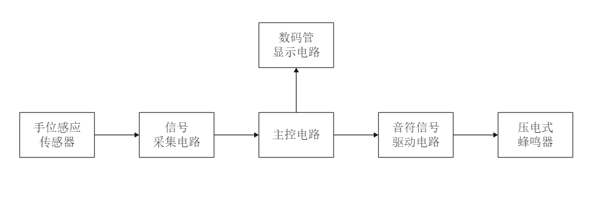
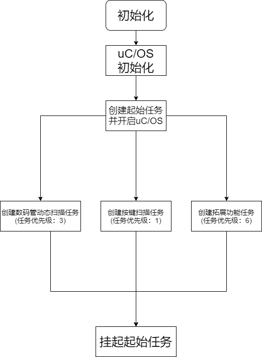

# 手位式感应电子琴

**在STM32F103C8T6上移植uC/OS II，实现无接触式感应电子琴**

- **项目地址：** [https://github.com/MarioLulab/electronic_piano](https://github.com/MarioLulab/electronic_piano)

- **作者：** Lu Qi ([https://github.com/MarioLulab](https://github.com/MarioLulab))

## 功能
- **供电：系统采用稳压电源提供的任选电压的单电源供电。**

- **演奏音符范围：系统能输出从低音6La至高音2Re的标准音符信号。**

- **音频误差：系统输出音符信号的频率误差不超过标准音符频率的1%。**

- **响应时间：演奏者的手位变化至输出音符变化的响应延迟时间不大于0.2秒。**

- **手位移动范围：演奏最低音符至最高音符时，手的移动距离最小不低于30cm，最大不超过50cm，**

  **以方便演奏操作。**

- **音量要求：演奏时，加在压电式蜂鸣器两端的交流电压有效值应在3.5V±0.35V，低位显示音符：“1-7”，高位显示低、中、高三个音**

- **系统显示：系统以两位数码管显示输出音符，低位显示音符：“1-7”，高位显示低、中、高三个音**

  **系统显示：系统以两位数码管显示输出音符，低位显示音符：“1-7”，高位显示低、中、高三个音域的对应符号：“┣”，显示效果：清晰、稳定、无闪烁。**

- **实用功能：能自动判断有无演奏动作，在无人演奏（手位不在规定的演奏范围内）时，延时2秒**

  **后关闭蜂鸣器输出，并在数码管上显示“--”符号。**

## 总体方案设计

前向通道包括传感器、信号采集电路，实现对手位信息的采集。主控电路是以STM32F103C8单片机为核心的数字系统，单片机基本系统是整个控制系统的核心，它负责完成整个系统的信息处理及协调功能。后向通道是实现控制信号输出的通道，单片机系统产生的控制信号经过放大电路放大，控制蜂鸣器振动频率，以发出与手位相对应的音符声音。数码管显示电路作为人机交互部分，在主控电路控制下实时显示当前发声的音符信息。另外还有系统的供电电源和稳压模块没有画出，但却是系统正常运行所必需的。

## 软件部分介绍
- 代码结构
    - APP：应用程序源码；
    - BSP:   OS CPU system tick设置；
    - CPU:  CPU相关设置
    - HARDWARE：底层硬件控制源码
    - LIB : uC/OS II 所使用的库文件
    - OUTPUT：编译生成文件
    - UCOS：uC/OS II 内核源码
    
- 主程序流程图

    

## 设计文档下载
见"设计报告.docx"

